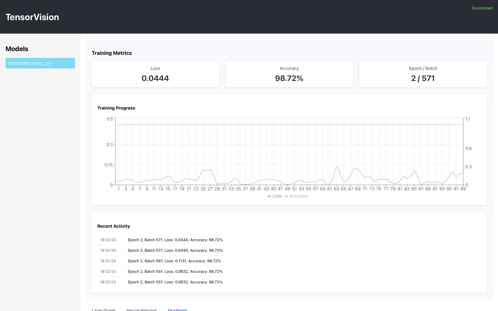
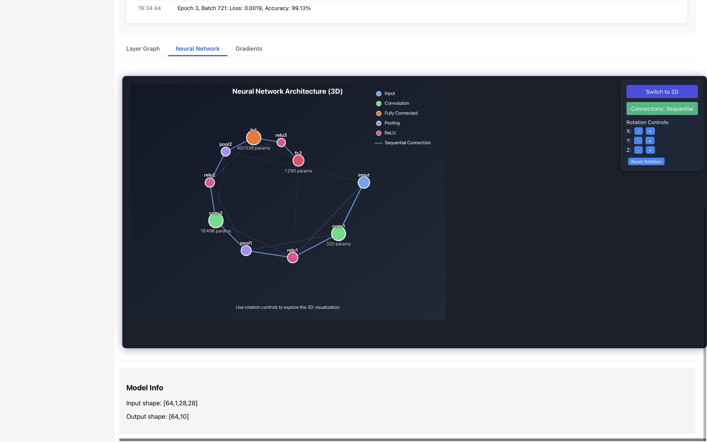

# TensorVision

> ⚠️ **Work in Progress** - This project is currently under active development. Features and APIs may change.

A visual-first approach to machine learning development and debugging. TensorVision is a lightweight framework that wraps PyTorch models to provide real-time visualization and debugging capabilities.

## Screenshots


*Real-time monitoring of model training with performance metrics*


*Interactive neural network visualization with 3D model architecture and real-time gradient visualizations*

## Features

- Interactive visualization of neural network architectures
- Real-time monitoring of tensor activations and gradients
- Model structure exploration through an intuitive web interface
- Non-intrusive integration with existing PyTorch code
- Transparent monitoring of training and inference

## Installation

### Prerequisites

- Python 3.7+
- PyTorch 1.8+
- Node.js 14+

### Backend Setup

```bash
# Clone the repository
git clone https://github.com/yourusername/tensor-vision.git
cd tensor-vision

# Create a virtual environment
python -m venv venv
source venv/bin/activate  # On Windows: venv\Scripts\activate

# Install dependencies
pip install torch torchvision flask flask-cors
```

### Frontend Setup

```bash
# Navigate to the frontend directory
cd frontend

# Install dependencies
npm install
```

## Getting Started

TensorVision consists of two main components:
1. A Python backend for model monitoring and data collection
2. A React frontend for visualization

### Running the Backend

Example usage with a pre-trained ResNet model:

```python
import torch
import torchvision.models as models
from tensor_vision import VisualizableModel, VisualizationServer

# Load a pre-trained model
model = models.resnet18(pretrained=True)
model.eval()

# Create a visualizable wrapper
visual_model = VisualizableModel(model)

# Process an input
dummy_input = torch.randn(1, 3, 224, 224)
output = visual_model(dummy_input)

# Start the visualization server
server = VisualizationServer(port=8000)
server.register_model(visual_model, "resnet18")
print(f"Starting server at http://localhost:8000")
server.start(use_thread=False)  # Blocking call
```

### Running the Frontend

```bash
# From the frontend directory
npm start
```

This will start the development server at http://localhost:3000, where you can access the visualization interface.

## Examples

The repository includes two example scripts:

### 1. ResNet Visualization

```bash
python -m examples.resnet_example
```

Visualizes a pre-trained ResNet model with a random input tensor.

### 2. MNIST Training

```bash
python -m examples.mnist_training
```

Demonstrates real-time visualization of a CNN during MNIST training.

## Project Structure

```
tensor-vision/
├── tensor_vision/
│   ├── core/
│   │   ├── monitor.py         # Tensor monitoring functionality
│   │   └── model_wrapper.py   # PyTorch model wrapper
│   └── server/
│       └── app.py             # Flask server for visualization
├── frontend/
│   ├── public/
│   └── src/
│       ├── components/        # React components
│       └── services/          # API integration
└── examples/
    ├── resnet_example.py
    └── mnist_training.py
```

## Extending TensorVision

TensorVision is designed to be modular and extensible. You can add new visualization types by:

1. Adding data collection in the `TensorMonitor` class
2. Creating new API endpoints in the Flask server
3. Implementing corresponding visualization components in React

## Future Development

- Interactive model editing
- Time-travel debugging
- Memory profiling
- Integration with training workflows

## Contributing

Contributions are welcome! Please feel free to submit a Pull Request.

## License

This project is licensed under the MIT License.
